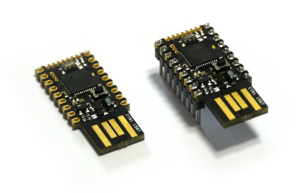

# Post

## Name
[`PST-2016-03-27_performances_espruino_pico`]()

## Title
2016-03-27 Performances Espruino Pico

## Description

### Objectif
Pulse sur une 1/2 période à 3.5MHz -> p=285ns, p/2 = 142ns

### Test 1

~~~~ js
var l;
function toggle() {
    digitalWrite(A5,l=!l);
}
setInterval(toggle,0.001);
~~~~

fréq max : 1694Hz/590µs

### Test 2

~~~~ js
var l;
function toggle() {
  digitalWrite(A5,l=!l);
}
setInterval(toggle,0.001);
~~~~

fréq max : 2092Hz/476µs

### Test 3

~~~~ js
function toggler() {
  "xxxcompiled";
  var l=0;
  var pA5 = 0|A5.getInfo().out_addr;
  digitalWrite(A5,0);
  var cnt = 100000;
  for (var i=0;i<cnt;i++) {
    poke32(pA5, l=!l); // on
  }
}

toggler();
~~~~

fréq max : 2164Hz/462µs

### Test 4

~~~~ js
function t() {
  "compiled";
  var l=0;
  var pA5 = 0|A5.getInfo().out_addr;
  digitalWrite(A5,0);
  var cnt = 100000;
  for (var i=0;i<cnt;i++) {
    a=123;
    poke32(pA5, 1); // on
    a=456;
    poke32(pA5, 0); // off
  }
}
t();
~~~~

fréq max : 13333Hz/75µs

### Test 5

~~~~ js
function t() {
  "compiled";
  var l=0;
  var pA5 = 0|A5.getInfo().out_addr;
  digitalWrite(A5,0);
  var cnt = 10000000;
  for (var i=0;i<cnt;i++) {
    poke32(pA5, 1); // on
    poke32(pA5, 0); // off
    poke32(pA5, 1); // on
    poke32(pA5, 0); // off
  }
}

t();
~~~~

fréq max : 6.666MHz/150ns, pulse=75ns

### Test 6

~~~~ js
analogWrite(A5,0.1,{freq:8000000});
~~~~

fréq max : 8MHz/125ns, pulse=50ns

