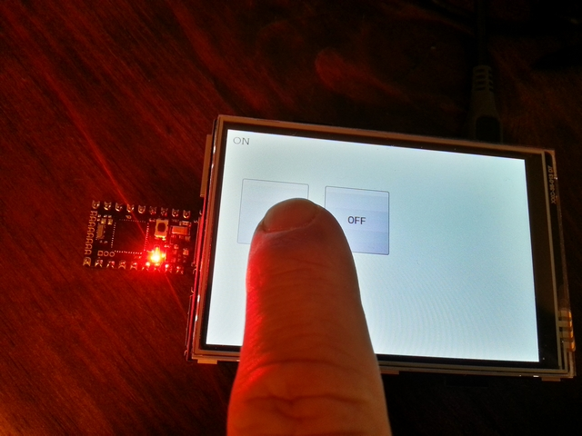

# Post

## Name
[`PST-2016-03-28_raspberry_pi_3_espruino_pico`]()

## Title
Communication entre Raspberry Pi 3 & Espruino Pico

## Description

### Installation écran TFT 3.5" 480x320

~~~~sh
tar xvf LCD-show-151020.tar.gz
cd LCD-show/
sudo ./LCD35-show
sudo shutdown -h
~~~~

Utiliser raspi_config pour étendre la mémoire de la carte SD

~~~~sh
raspi_config
df -h
~~~~

Lancer un server vnc (login pi/raspberry)

~~~~sh
vncserver :1 -geometry 1024x768 -depth 24
~~~~

### Communication RPi / Pico

Lister les devices

~~~~sh
ls /dev/ttyACM* /dev/ttyUSB* /dev/ttyAMA*
~~~~

Ici on utilisera `/dev/ttyACM0`

Utilisation de minicom

~~~~sh
sudo apt-get install minicom
minicom -b9600 -D /dev/ttyACM0
~~~~

Lancement d'un miniserveur HTTP

~~~~sh
python3 -m http.server --cgi 8000
~~~~

Ecriture d'un script cgi sous `./cgi-bin`

~~~~python
 #!/usr/bin/python3
 # -*- coding: utf-8 -*

import cgi
import serial

ser=serial.Serial('/dev/ttyACM0', 9600)
form = cgi.FieldStorage()
print("Content-type: text/html; charset=utf-8\n")

led=form.getvalue("led")
if led=="ON" : ser.write(bytes("digitalWrite(LED1,1);\r\n","UTF-8"))
if led=="OFF" : ser.write(bytes("digitalWrite(LED1,0);\r\n","UTF-8"))

print(led)

html = """<!DOCTYPE html>
<head>
    <title>Mon programme</title>
</head>
<body>
    <form action="/cgi-bin/index.py" method="post">
           
        &nbsp;&nbsp;&nbsp;
        <input type="submit" name="led" value="ON" style="width:100px;height:100px;">
        &nbsp;&nbsp;&nbsp;
        <input type="submit" name="led" value="OFF" style="width:100px;height:100px;">
    </form>
</body>
</html>
"""

print(html)
~~~~
