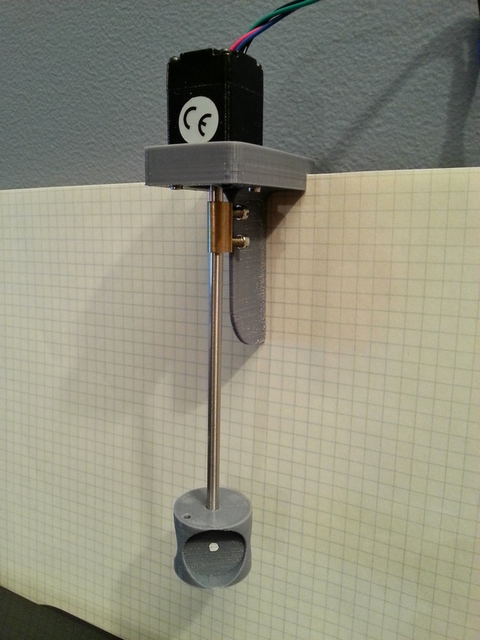

# Post

## Name
[`PST-2016-06-15_sonde_us_experimentation`]()

## Title
2016-06-15 Sonde ultra-sons d'expérimentation en aquarium

## Description
@Jerome, @Joris, voici quelques infos pour réaliser une sonde d'expérimentation à pincer sur le bord de l'aquarium.

### Ingrédients
* DRV8834 Low-Voltage Stepper Motor Driver Carrier.
* Stepper Motor: Bipolar, 200 Steps/Rev, 20×30mm, 3.9V, 0.6 A/Phase.
* 4 vis M2.
* Axe de 4mm.
* Support et tambour réalisés en impression 3D en PLA.

### Remarques
* Envisager des clips pour guider le fil le long de l'axe jusqu'au transducteur.
* Les petites vis du coupleur d'axe butent sur le support et c'est normal, cela permet de repérer une origine de position 0 en faisant "reculer" pendant 360° et caler le moteur sur cette butée. Cela évite aussi de faire des noeuds avec les fils du transducteur en cas de fausse manip.
* Le moteur et le driver ont été achetés chez Lextronic mais il semble qu'ils n'aient pas le moteur dispo en ce moment, le mien était < 20€
* On pourrait essayer avec un moteur de CD-ROM mais je ne sais pas si il serait assez puissant.
* ATTENTION : avant toute chose, il faut régler le courant maxi sur le driver (§ "Current limiting"). Sinon le moteur peut très vite surchauffer même à l'arrêt. Sachant qu'on va "caler" le moteur sur une butée, on va chercher à régler le courant sur le minimum qui permet de ne pas perdre de pas mais qui permette de ne pas trop forcer sur la butée. Tout cela sera à expérimenter avec le transducteur en place (voir 3 transducteurs).
* Ce driver Pololu a l'avantage de fonctionner dès 2.5V. Donc tout fonctionne bien sous 5V.
* Le moteur est un 200 pas/tr mais le driver descend jusqu'au 1/32 de pas.
* Sur mes tests, en pilotant le moteur en 1/8, soit 1600 pas et en trichant un peu sur le secteur balayé (67.5°) cela donne un secteur de 300 pas et un tir tous les 1.5 pas. Soit un tir tous les 3 fronts (montants ou descendants) du signal de commande du driver.  La fréquence d'IT pour générer le signal de commande sera alors de 9 kHz pour obtenir 15 fps. Tout cela devant être ajustable en jouant sur les différents paramètres. L'idée à terme étant de déporter au maximum la génération de ces signaux dans les timers du µC pour libérer des cycles CPU.
* On considère pour l'instant que le moteur a assez de couple pour inverser son mouvement en un seul pas. Sinon il faudra affiner la loi de vitesse.

Ci-joint, un source, un peu expérimental ;-), en µPython d'une version n'utilisant pas au maximum des timers et qui consomme déjà 22% de CPU sur un STM32F405 à 160 MHz.

main-v1.py 3.95 KB

~~~~ python
 # main.py -- put your code here!
import sys
import stm
TIMER  = const(11)

 # start flash
print("Start!")
pyb.LED(1).on()
def flash(timer):
	pyb.LED(1).toggle()
	pyb.LED(2).toggle()

t11=pyb.Timer(TIMER ,freq=10, callback=flash)
pyb.delay(1000)
t11.callback(None)

 # Constants
MICROSTEPS   = const(8)                  # 8
STPS_TR      = const(200*MICROSTEPS)     # 1600 �stp/tr
SECTOR       = const((STPS_TR*3)//16)    # 300 = 67.5� //6
SECTORS_S    = const(15)                 # 15 fps
SLOW         = const(STPS_TR // 2)       # 800 stp/s
FAST         = const(SECTOR * SECTORS_S) # 4500 stp/s
PULSE_MODULO = const(SECTOR*2//200)      # 3

nEN    = pyb.Pin('B15', pyb.Pin.OUT_PP)
DIR    = pyb.Pin('A5', pyb.Pin.OUT_PP)
STP    = pyb.Pin('A6', pyb.Pin.OUT_PP)
BIT6   = const(1 << 6)
PA     = stm.GPIOA + stm.GPIO_ODR
FRAME_PIN = pyb.Pin('B12', pyb.Pin.OUT_PP) #LED_GREEN
PULSE_PIN = pyb.Pin('B10', pyb.Pin.OUT_PP) #LED_RED=B2
BIT10  = const(1 << 10)
PORT_B = stm.GPIOB + stm.GPIO_ODR

 # Global vars
stp_pos  = 0
stp_from = 0
stp_to   = 0
stp_dir  = 0
stp_tim  = pyb.Timer(TIMER,freq=1, callback=None)
v0 = 0
v1 = 1

 # Irq handler
@micropython.native
def one_step(timer):
	global stp_pos
	global stp_dir
	
	if stp_pos==stp_from and stp_pos==stp_to:
		timer.callback(None)
	elif stp_pos==stp_from:
		stp_dir = +1
		DIR(1)
		FRAME_PIN(1)
		FRAME_PIN(0)
		
	elif stp_pos==stp_to:
		stp_dir = -1
		DIR(0)
		FRAME_PIN(1)
		FRAME_PIN(0)

	if STP():
		STP(0)
		stp_pos += stp_dir
	else:
		STP(1)
		if(stp_pos % PULSE_MODULO == 0):  # /!\ petit bug : ici on ne tir qu'une fois tous les 3 fronts montants
			pulse()                         # soit 100 tirs / secteurs

 # Functions
@micropython.viper
def pulse():
	odr = ptr16(PORT_B)
	#odr[0] ^= BIT10

	v0=odr[0]
	v1=v0 | BIT10
	a=1
	odr[0] = v1 # STP(1)+19.5�s
	a+=1
	a+=1
	odr[0] = v0 # +200ns
	
	#global v0
	#global v1
	#PULSE_PIN(1) #STP(1)+14�s				
	#PULSE_PIN(0) #+4.5�s
	#v0=stm.mem16[PORT_B]
	#v1=v0 | BIT10
	#stm.mem16[PORT_B] = v1
	#stm.mem16[PORT_B] = v0

def osc_move(from_pos, to_pos):
	global stp_pos
	global stp_from
	global stp_to
	global stp_dir
	global stp_tim

	stp_from=from_pos
	stp_to=to_pos
	if stp_pos <= stp_to:
		stp_dir = +1
		DIR(1)
	else:
		stp_dir = -1
		DIR(0)
	stp_tim.callback(one_step)
		
def abs_move(pos):
	osc_move(pos, pos)
	stp_wait()

def incr_move(nb_steps):
	global stp_pos
	abs_move(stp_pos + nb_steps)

def stp_wait():
	global stp_pos
	global stp_to
	while stp_pos!=stp_to: pyb.delay(1)

def stp_set_org():
	global stp_pos
	stp_pos=0
	
def stp_speed(stp_s):
	global stp_tim
	stp_tim.freq(stp_s*2)

def stp_on():
	nEN(0)
	PULSE_PIN(0)
	
def stp_off():
	nEN(1)

def stp_stop():
	global stp_tim
	stp_tim.callback(None)

def stp_microsteps(n):
	# m0 m1 �steps
	# 0  0  1
	# 1  0  1/2
	# ~  0  1/4
	# 0  1  1/8
	# 1  1  1/16
	# ~  1  1/32
	if n==2:
		m0 = pyb.Pin('B14', pyb.Pin.OUT_PP)(1)
		m1 = pyb.Pin('B13', pyb.Pin.OUT_PP)(0)
	elif n==4:
		m0 = pyb.Pin('B14', pyb.Pin.OUT_OD)(1)
		m1 = pyb.Pin('B13', pyb.Pin.OUT_PP)(0)
	elif n==8:
		m0 = pyb.Pin('B14', pyb.Pin.OUT_PP)(0)
		m1 = pyb.Pin('B13', pyb.Pin.OUT_PP)(1)
	elif n==16:
		m0 = pyb.Pin('B14', pyb.Pin.OUT_PP)(1)
		m1 = pyb.Pin('B13', pyb.Pin.OUT_PP)(1)
	elif n==32:
		m0 = pyb.Pin('B14', pyb.Pin.OUT_OD)(1)
		m1 = pyb.Pin('B13', pyb.Pin.OUT_PP)(1)
	else:
		m0 = pyb.Pin('B14', pyb.Pin.OUT_PP)(0)
		m1 = pyb.Pin('B13', pyb.Pin.OUT_PP)(0)
		
@micropython.native
def kloops_ps():
	t0 = pyb.millis()
	cnt = 0
	while pyb.elapsed_millis(t0) < 100:
		cnt+=1
	return cnt//100
	
 # Main
cnt_max = kloops_ps()
print("cnt_max = ",cnt_max,"k")
stp_microsteps(MICROSTEPS)
stp_on()
stp_speed(SLOW)
incr_move(-STPS_TR)
stp_set_org()
stp_speed(FAST)
osc_move(0, SECTOR)
cnt_cur = kloops_ps()
print("cnt_cur = ", cnt_cur,"k")
print("load = ", (1-cnt_cur/cnt_max)*100, "%")
print("ticks/pulse = ", PULSE_MODULO)

print("Command >>>")
~~~~
