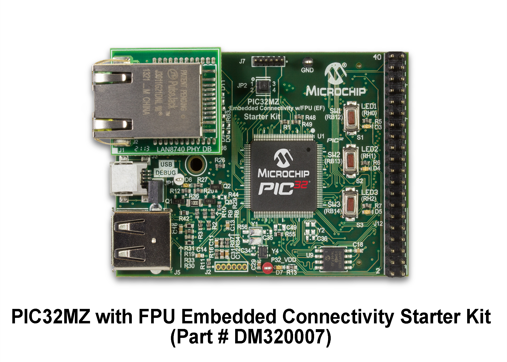

# Post

## Name
[`PST-2016-09-01_essais_pic32mz`]()

## Title
Mise en route carte d'évaluation PIC32MZ.

## Description

### Téléchargements
D'après https://www.microchip.com/design-centers/32-bit

Téléchargement des applications ( > 1 Go ):

* [MPLAB® X IDE v3.35](https://www.microchip.com/mplab/mplab-x-ide) : l'IDE Microchip, *Free Integrated Development Environment for all Microchip microcontrollers*.
* [MPLAB® XC32 Compiler v1.42](https://www.microchip.com/mplab/compilers) : le compilateur, *Full-featured ANSI-compliant C compiler for PIC32 microcontrollers*.
* [MPLAB® Harmony Integrated Software Framework v1.08.01](https://www.microchip.com/mplab/mplab-harmony) : le framework, *MPLAB Harmony is a flexible, abstracted, fully integrated firmware development environment for PIC32 microcontrollersMPLAB Harmony is a flexible, abstracted, fully integrated firmware development environment for PIC32 microcontrollers*.

MPLab X IDE est en fait un Netbeans modifié par Microchip. Il faut y installer le configurateur MPLAB® Harmony configurator(MHC) comme un plugin : `Tools->Plugins->Available`.

### Création du projet "blinky"

ATTENTION, sous Windows, le projet doit se trouver sur le même disque que Harmony et l'arborescence ne doit pas être trop profonde...

Depuis MPLab X IDE

* File->Create New Project->Microchip Embedded->32-bit MAPLAB Harmony Project->Nest >
* Project name : blinky
* Configuration : default
* Device : PIC32MZ, Target : PIC32MZ2048EFH144
* Finish

Générer les premiers fichier de configuration. Pour faire clignoter les LED on aura besoin du Driver Timer :

* Onglet MPLAB Harmony Configurator->Options
* Drivers->Timer->Use Timer
* Bouton Generate Code
* Ok pour la sauvegarde du *.mhc
* generate pour générer ou mettre à jour la trame des fichiers *.c et *.h

Compléter le code

* Le fichier Source Files/app/main.c est normalement correct
* Le fichier Source Files/app/app.c :

~~~Cpp 
/*******************************************************************************
  MPLAB Harmony Application Source File
  
  Company:
    Microchip Technology Inc.
  
  File Name:
    app.c

  Summary:
    This file contains the source code for the MPLAB Harmony application.

  Description:
    This file contains the source code for the MPLAB Harmony application.  It 
    implements the logic of the application's state machine and it may call 
    API routines of other MPLAB Harmony modules in the system, such as drivers,
    system services, and middleware.  However, it does not call any of the
    system interfaces (such as the "Initialize" and "Tasks" functions) of any of
    the modules in the system or make any assumptions about when those functions
    are called.  That is the responsibility of the configuration-specific system
    files.
 *******************************************************************************/

// DOM-IGNORE-BEGIN
/*******************************************************************************
Copyright (c) 2013-2014 released Microchip Technology Inc.  All rights reserved.

Microchip licenses to you the right to use, modify, copy and distribute
Software only when embedded on a Microchip microcontroller or digital signal
controller that is integrated into your product or third party product
(pursuant to the sublicense terms in the accompanying license agreement).

You should refer to the license agreement accompanying this Software for
additional information regarding your rights and obligations.

SOFTWARE AND DOCUMENTATION ARE PROVIDED "AS IS" WITHOUT WARRANTY OF ANY KIND,
EITHER EXPRESS OR IMPLIED, INCLUDING WITHOUT LIMITATION, ANY WARRANTY OF
MERCHANTABILITY, TITLE, NON-INFRINGEMENT AND FITNESS FOR A PARTICULAR PURPOSE.
IN NO EVENT SHALL MICROCHIP OR ITS LICENSORS BE LIABLE OR OBLIGATED UNDER
CONTRACT, NEGLIGENCE, STRICT LIABILITY, CONTRIBUTION, BREACH OF WARRANTY, OR
OTHER LEGAL EQUITABLE THEORY ANY DIRECT OR INDIRECT DAMAGES OR EXPENSES
INCLUDING BUT NOT LIMITED TO ANY INCIDENTAL, SPECIAL, INDIRECT, PUNITIVE OR
CONSEQUENTIAL DAMAGES, LOST PROFITS OR LOST DATA, COST OF PROCUREMENT OF
SUBSTITUTE GOODS, TECHNOLOGY, SERVICES, OR ANY CLAIMS BY THIRD PARTIES
(INCLUDING BUT NOT LIMITED TO ANY DEFENSE THEREOF), OR OTHER SIMILAR COSTS.
 *******************************************************************************/
// DOM-IGNORE-END

// *****************************************************************************
// *****************************************************************************
// Section: Included Files 
// *****************************************************************************
// *****************************************************************************

#include "app.h"

// *****************************************************************************
// *****************************************************************************
// Section: Global Data Definitions
// *****************************************************************************
// *****************************************************************************

// *****************************************************************************
/* Application Data

  Summary:
    Holds application data

  Description:
    This structure holds the application's data.

  Remarks:
    This structure should be initialized by the APP_Initialize function.
    
    Application strings and buffers are be defined outside this structure.
*/

APP_DATA appData;

// *****************************************************************************
// *****************************************************************************
// Section: Application Callback Functions
// *****************************************************************************
// *****************************************************************************

/* TODO:  Add any necessary callback functions.
*/
/* Application's Timer Callback Function */
static void APP_TimerCallback (  uintptr_t context, uint32_t alarmCount )
{
    appData.timerAlarmCount++;
    if (APP_TMR_ALARM_COUNT_MAX < appData.timerAlarmCount)
    {
        appData.timerAlarmCount = 0;
    }
}

// *****************************************************************************
// *****************************************************************************
// Section: Application Local Functions
// *****************************************************************************
// *****************************************************************************

/* TODO:  Add any necessary local functions.
*/
/* Application's Blinky LED Setup Function */
static void APP_BlinkyLedSetup( void )
{

    DRV_TMR_Alarm16BitRegister(appData.handleTmr, APP_TMR_ALARM_PERIOD, true,
                               (uintptr_t)NULL, APP_TimerCallback);
    DRV_TMR_Start(appData.handleTmr);

    SYS_PORTS_PinDirectionSelect(PORTS_ID_0, SYS_PORTS_DIRECTION_OUTPUT,
                                 APP_LED_PORT, APP_LED_PIN);
}

/* Application's Blinky LED Update Function */
static void APP_BlinkyLedUpdate( void )
{
    if ( appData.timerAlarmCount < APP_TMR_ALARM_COUNT_LED_ON )
    {
        if (!appData.ledIsOn)
        {
            appData.ledIsOn = true;
            //SYS_PORTS_PinSet(PORTS_ID_0, APP_LED_PORT, APP_LED_PIN);
            BSP_LEDOn(BSP_LED_1);
            BSP_LEDOn(BSP_LED_2);
            BSP_LEDOn(BSP_LED_3);
        }
    }
    else
    {
        if (appData.ledIsOn)
        {
            appData.ledIsOn = false;
            //SYS_PORTS_PinClear(PORTS_ID_0, APP_LED_PORT, APP_LED_PIN);
            BSP_LEDOff(BSP_LED_1);
            BSP_LEDOff(BSP_LED_2);
            BSP_LEDOff(BSP_LED_3);
        }
    }
}

// *****************************************************************************
// *****************************************************************************
// Section: Application Initialization and State Machine Functions
// *****************************************************************************
// *****************************************************************************

/*******************************************************************************
  Function:
    void APP_Initialize ( void )

  Remarks:
    See prototype in app.h.
 */

void APP_Initialize ( void )
{
    /* Place the App state machine in its initial state. */
    appData.state = APP_STATE_INIT;

    
    /* TODO: Initialize your application's state machine and other
     * parameters.
     */
    appData.timerAlarmCount = 0;
    appData.ledIsOn = false;
}

/******************************************************************************
  Function:
    void APP_Tasks ( void )

  Remarks:
    See prototype in app.h.
 */

void APP_Tasks ( void )
{
    switch ( appData.state )
    {
        case APP_STATE_INIT:
        {
            appData.handleTmr = DRV_TMR_Open(APP_TMR_DRV_INDEX, DRV_IO_INTENT_EXCLUSIVE);
            if( DRV_HANDLE_INVALID != appData.handleTmr )
            {
                APP_BlinkyLedSetup();
                appData.state = APP_STATE_WAIT_FOR_ALARM;
            }
            break;
        }

        case APP_STATE_WAIT_FOR_ALARM:
        {
            APP_BlinkyLedUpdate();
            break;
        }

        default:
        {
            break;
        }
    }
}
 
/*******************************************************************************
 End of File
 */

~~~

* Le fichier Header Files/app/app.h :

~~~Cpp
/*******************************************************************************
  MPLAB Harmony Application Header File

  Company:
    Microchip Technology Inc.

  File Name:
    app.h

  Summary:
    This header file provides prototypes and definitions for the application.

  Description:
    This header file provides function prototypes and data type definitions for
    the application.  Some of these are required by the system (such as the
    "APP_Initialize" and "APP_Tasks" prototypes) and some of them are only used
    internally by the application (such as the "APP_STATES" definition).  Both
    are defined here for convenience.
*******************************************************************************/

//DOM-IGNORE-BEGIN
/*******************************************************************************
Copyright (c) 2013-2014 released Microchip Technology Inc.  All rights reserved.

Microchip licenses to you the right to use, modify, copy and distribute
Software only when embedded on a Microchip microcontroller or digital signal
controller that is integrated into your product or third party product
(pursuant to the sublicense terms in the accompanying license agreement).

You should refer to the license agreement accompanying this Software for
additional information regarding your rights and obligations.

SOFTWARE AND DOCUMENTATION ARE PROVIDED "AS IS" WITHOUT WARRANTY OF ANY KIND,
EITHER EXPRESS OR IMPLIED, INCLUDING WITHOUT LIMITATION, ANY WARRANTY OF
MERCHANTABILITY, TITLE, NON-INFRINGEMENT AND FITNESS FOR A PARTICULAR PURPOSE.
IN NO EVENT SHALL MICROCHIP OR ITS LICENSORS BE LIABLE OR OBLIGATED UNDER
CONTRACT, NEGLIGENCE, STRICT LIABILITY, CONTRIBUTION, BREACH OF WARRANTY, OR
OTHER LEGAL EQUITABLE THEORY ANY DIRECT OR INDIRECT DAMAGES OR EXPENSES
INCLUDING BUT NOT LIMITED TO ANY INCIDENTAL, SPECIAL, INDIRECT, PUNITIVE OR
CONSEQUENTIAL DAMAGES, LOST PROFITS OR LOST DATA, COST OF PROCUREMENT OF
SUBSTITUTE GOODS, TECHNOLOGY, SERVICES, OR ANY CLAIMS BY THIRD PARTIES
(INCLUDING BUT NOT LIMITED TO ANY DEFENSE THEREOF), OR OTHER SIMILAR COSTS.
 *******************************************************************************/
//DOM-IGNORE-END

#ifndef _APP_H
#define _APP_H

// *****************************************************************************
// *****************************************************************************
// Section: Included Files
// *****************************************************************************
// *****************************************************************************

#include <stdint.h>
#include <stdbool.h>
#include <stddef.h>
#include <stdlib.h>
#include "system_config.h"
#include "system_definitions.h"

// DOM-IGNORE-BEGIN
#ifdef __cplusplus  // Provide C++ Compatibility

extern "C" {

#endif
// DOM-IGNORE-END 

// *****************************************************************************
// *****************************************************************************
// Section: Type Definitions
// *****************************************************************************
// *****************************************************************************

// *****************************************************************************
/* Application states

  Summary:
    Application states enumeration

  Description:
    This enumeration defines the valid application states.  These states
    determine the behavior of the application at various times.
*/

typedef enum
{
	/* Application's state machine's initial state. */
	APP_STATE_INIT=0,

	/* TODO: Define states used by the application state machine. */
    APP_STATE_WAIT_FOR_ALARM

} APP_STATES;

// *****************************************************************************
/* Application Data

  Summary:
    Holds application data

  Description:
    This structure holds the application's data.

  Remarks:
    Application strings and buffers are be defined outside this structure.
 */

typedef struct
{
    /* The application's current state */
    APP_STATES state;

    /* TODO: Define any additional data used by the application. */
    DRV_HANDLE handleTmr;
    unsigned int timerAlarmCount;
    bool ledIsOn;

} APP_DATA;

// *****************************************************************************
// *****************************************************************************
// Section: Application Callback Routines
// *****************************************************************************
// *****************************************************************************
/* These routines are called by drivers when certain events occur.
*/
	
// *****************************************************************************
// *****************************************************************************
// Section: Application Initialization and State Machine Functions
// *****************************************************************************
// *****************************************************************************

/*******************************************************************************
  Function:
    void APP_Initialize ( void )

  Summary:
     MPLAB Harmony application initialization routine.

  Description:
    This function initializes the Harmony application.  It places the 
    application in its initial state and prepares it to run so that its 
    APP_Tasks function can be called.

  Precondition:
    All other system initialization routines should be called before calling
    this routine (in "SYS_Initialize").

  Parameters:
    None.

  Returns:
    None.

  Example:
    <code>
    APP_Initialize();
    </code>

  Remarks:
    This routine must be called from the SYS_Initialize function.
*/

void APP_Initialize ( void );

/*******************************************************************************
  Function:
    void APP_Tasks ( void )

  Summary:
    MPLAB Harmony Demo application tasks function

  Description:
    This routine is the Harmony Demo application's tasks function.  It
    defines the application's state machine and core logic.

  Precondition:
    The system and application initialization ("SYS_Initialize") should be
    called before calling this.

  Parameters:
    None.

  Returns:
    None.

  Example:
    <code>
    APP_Tasks();
    </code>

  Remarks:
    This routine must be called from SYS_Tasks() routine.
 */

void APP_Tasks( void );

#endif /* _APP_H */

//DOM-IGNORE-BEGIN
#ifdef __cplusplus
}
#endif
//DOM-IGNORE-END

/*******************************************************************************
 End of File
 */

~~~

* Le fichier Header Files/app/system_config/default/system_config.h :

~~~Cpp
/*******************************************************************************
  MPLAB Harmony System Configuration Header

  File Name:
    system_config.h

  Summary:
    Build-time configuration header for the system defined by this MPLAB Harmony
    project.

  Description:
    An MPLAB Project may have multiple configurations.  This file defines the
    build-time options for a single configuration.

  Remarks:
    This configuration header must not define any prototypes or data
    definitions (or include any files that do).  It only provides macro
    definitions for build-time configuration options that are not instantiated
    until used by another MPLAB Harmony module or application.

    Created with MPLAB Harmony Version 1.08.01
*******************************************************************************/

// DOM-IGNORE-BEGIN
/*******************************************************************************
Copyright (c) 2013-2015 released Microchip Technology Inc.  All rights reserved.

Microchip licenses to you the right to use, modify, copy and distribute
Software only when embedded on a Microchip microcontroller or digital signal
controller that is integrated into your product or third party product
(pursuant to the sublicense terms in the accompanying license agreement).

You should refer to the license agreement accompanying this Software for
additional information regarding your rights and obligations.

SOFTWARE AND DOCUMENTATION ARE PROVIDED AS IS WITHOUT WARRANTY OF ANY KIND,
EITHER EXPRESS OR IMPLIED, INCLUDING WITHOUT LIMITATION, ANY WARRANTY OF
MERCHANTABILITY, TITLE, NON-INFRINGEMENT AND FITNESS FOR A PARTICULAR PURPOSE.
IN NO EVENT SHALL MICROCHIP OR ITS LICENSORS BE LIABLE OR OBLIGATED UNDER
CONTRACT, NEGLIGENCE, STRICT LIABILITY, CONTRIBUTION, BREACH OF WARRANTY, OR
OTHER LEGAL EQUITABLE THEORY ANY DIRECT OR INDIRECT DAMAGES OR EXPENSES
INCLUDING BUT NOT LIMITED TO ANY INCIDENTAL, SPECIAL, INDIRECT, PUNITIVE OR
CONSEQUENTIAL DAMAGES, LOST PROFITS OR LOST DATA, COST OF PROCUREMENT OF
SUBSTITUTE GOODS, TECHNOLOGY, SERVICES, OR ANY CLAIMS BY THIRD PARTIES
(INCLUDING BUT NOT LIMITED TO ANY DEFENSE THEREOF), OR OTHER SIMILAR COSTS.
*******************************************************************************/
// DOM-IGNORE-END

#ifndef _SYSTEM_CONFIG_H
#define _SYSTEM_CONFIG_H

// *****************************************************************************
// *****************************************************************************
// Section: Included Files
// *****************************************************************************
// *****************************************************************************
/*  This section Includes other configuration headers necessary to completely
    define this configuration.
*/

// DOM-IGNORE-BEGIN
#ifdef __cplusplus  // Provide C++ Compatibility

extern "C" {

#endif
// DOM-IGNORE-END

// *****************************************************************************
// *****************************************************************************
// Section: System Service Configuration
// *****************************************************************************
// *****************************************************************************
// *****************************************************************************
/* Common System Service Configuration Options
*/
#define SYS_VERSION_STR           "1.08.01"
#define SYS_VERSION               10801

// *****************************************************************************
/* Clock System Service Configuration Options
*/
#define SYS_CLK_FREQ                        48000000ul
#define SYS_CLK_BUS_PERIPHERAL_1            48000000ul
#define SYS_CLK_UPLL_BEFORE_DIV2_FREQ       192000000ul
#define SYS_CLK_CONFIG_PRIMARY_XTAL         8000000ul
#define SYS_CLK_CONFIG_SECONDARY_XTAL       0ul
   
/*** Interrupt System Service Configuration ***/
#define SYS_INT                     true

/*** Ports System Service Configuration ***/

// *****************************************************************************
// *****************************************************************************
// Section: Driver Configuration
// *****************************************************************************
// *****************************************************************************
/*** Timer Driver Configuration ***/
#define DRV_TMR_INTERRUPT_MODE             true
#define DRV_TMR_INSTANCES_NUMBER           1
#define DRV_TMR_CLIENTS_NUMBER             1

/*** Timer Driver 0 Configuration ***/
#define DRV_TMR_PERIPHERAL_ID_IDX0          TMR_ID_1
#define DRV_TMR_INTERRUPT_SOURCE_IDX0       INT_SOURCE_TIMER_1
#define DRV_TMR_INTERRUPT_VECTOR_IDX0       INT_VECTOR_T1
#define DRV_TMR_ISR_VECTOR_IDX0             _TIMER_1_VECTOR
#define DRV_TMR_INTERRUPT_PRIORITY_IDX0     INT_PRIORITY_LEVEL1
#define DRV_TMR_INTERRUPT_SUB_PRIORITY_IDX0 INT_SUBPRIORITY_LEVEL0
#define DRV_TMR_CLOCK_SOURCE_IDX0           DRV_TMR_CLKSOURCE_INTERNAL
#define DRV_TMR_PRESCALE_IDX0               TMR_PRESCALE_VALUE_256
#define DRV_TMR_OPERATION_MODE_IDX0         DRV_TMR_OPERATION_MODE_16_BIT
#define DRV_TMR_ASYNC_WRITE_ENABLE_IDX0     false
#define DRV_TMR_POWER_STATE_IDX0            SYS_MODULE_POWER_RUN_FULL

 
// *****************************************************************************
// *****************************************************************************
// Section: Middleware & Other Library Configuration
// *****************************************************************************
// *****************************************************************************

// *****************************************************************************
// *****************************************************************************
// Section: Application Configuration
// *****************************************************************************
// *****************************************************************************

/*** Application Instance 0 Configuration ***/
#define APP_TMR_DRV_INDEX                   0
#define APP_TMR_ALARM_PERIOD                0xF424
#define APP_TMR_ALARM_COUNT_MAX             40
#define APP_TMR_ALARM_COUNT_LED_ON          20
#define APP_LED_PORT                        PORT_CHANNEL_H
#define APP_LED_PIN                         PORTS_BIT_POS_0

//DOM-IGNORE-BEGIN
#ifdef __cplusplus
}
#endif
//DOM-IGNORE-END

#endif // _SYSTEM_CONFIG_H
/*******************************************************************************
 End of File
*/
~~~

Compiler et charger le programme

* Run->Build main Project

